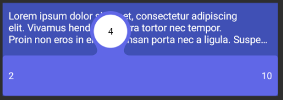

# Slider
Slider built on top of Android's SeekBar with support for floating point, steps and min value. It was created to solve some issues that are present in SeekBar. Min value support is added because min value is only available since Nougat on SeekBar.

## Screenshots

## Usage
Example shows IntSlider but FloatSlider works the same way just uses floats. You can even implement your own by extending Slider class.

    IntSlider slider = findViewById(R.id.slider); //or just create new IntSlider(...)
    slider.setTextView(findViewById(R.id.slider_title), String::valueOf);
    slider.setStep(2);
    slider.setMaxValue(8); //It is important to use this instead of setMax() for corrent behavior
    slider.setMinValue(1);
    slider.setValue(5); //Same goes for progress value if you would use setProgress(..) than you would directly modify progress value which might not correspond to desired progress
    slider.setOnValueChangeListener(((value, fromUser) -> Log.d("TAG", "Value " + value))); //Adds listener for value change, this is added to simplify callback for value change because standard SeekBar.OnSeekBarChangeListener cannot be written as lambda
    
## Issues

If you encounter any issues you can either report them as issues or if you fix them yourself, pull request would be appreciated.
